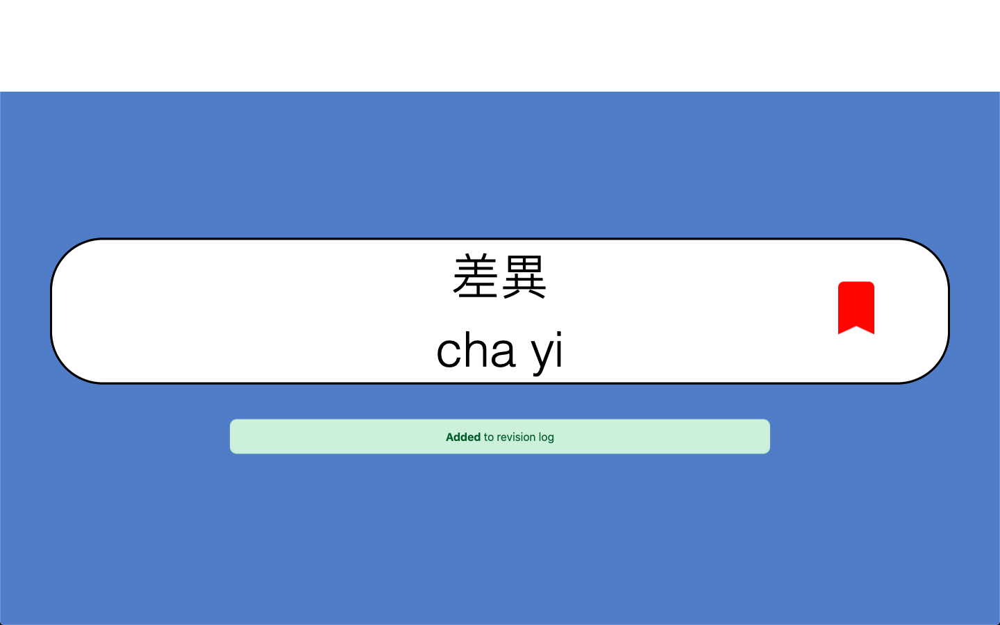
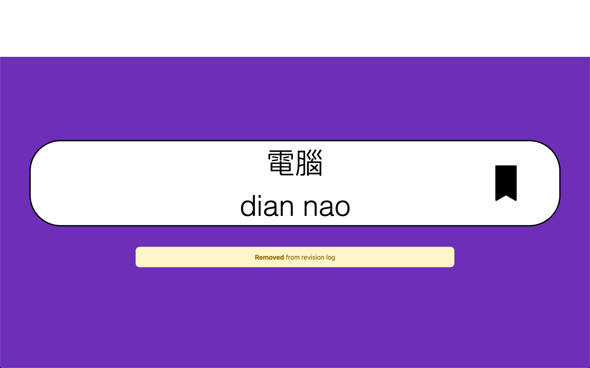
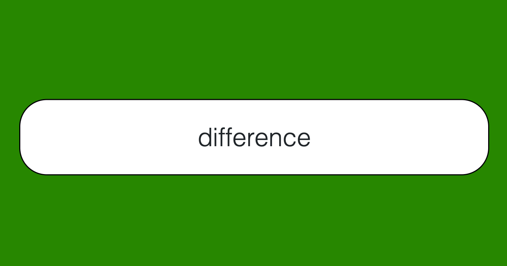

# Simple Flashcard system

2019 Summer internship project built for a client.

Used basic web programming (HTML, CSS, Vanilla JS) to create this simple flashcard system that allow students to review vocabularies.

